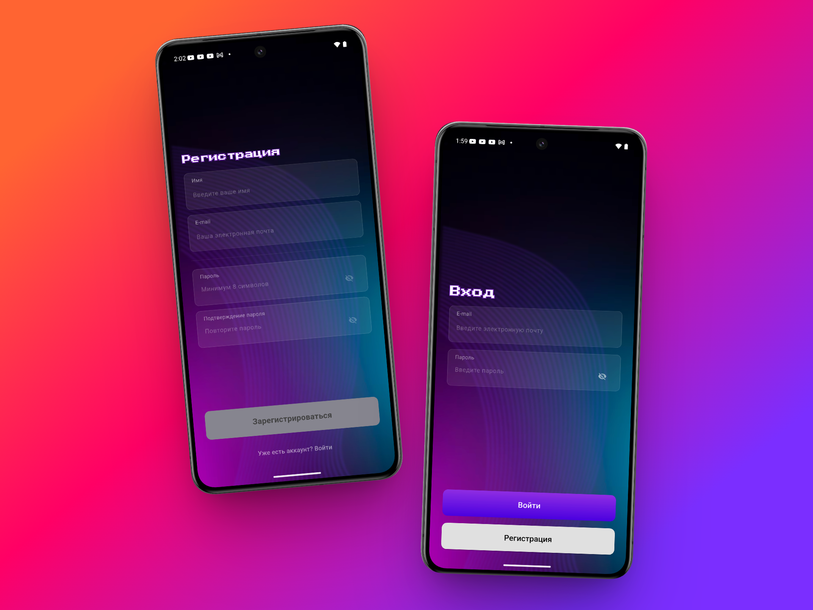
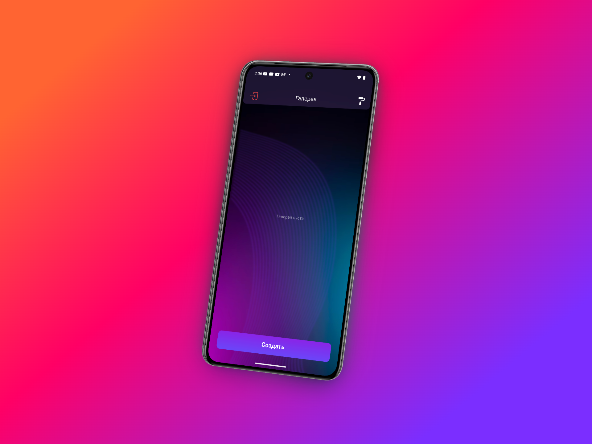
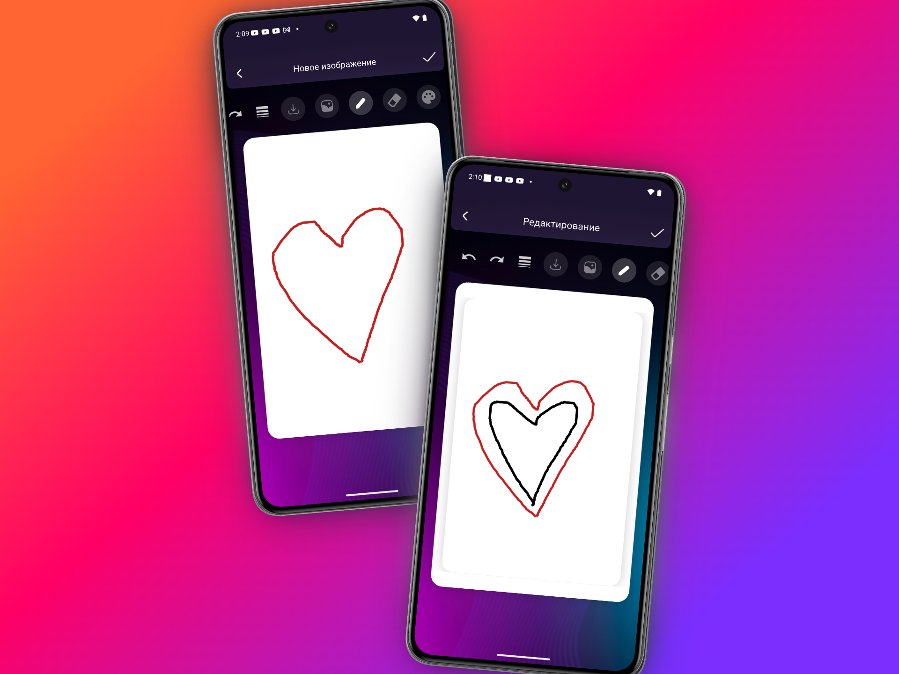

Paint X — Flutter Drawing & Editing App
Paint X — это современное мобильное приложение для iOS, разработанное на Flutter. Оно предоставляет пользователям мощные инструменты для цифрового рисования, редактирования фотографий и облачного хранения своих работ.

## 📱 Скриншоты приложения

|             Auth Screens             |             Home Screen              |           Painter Screens            |
|:------------------------------------:|:------------------------------------:|:------------------------------------:|
|  |  |  |

📋 Особенности проекта (ТЗ соответствие)
Приложение полностью соответствует требованиям технического задания:

Авторизация: Полноценная регистрация и вход через Firebase Auth с валидацией email и пароля (8+ символов).

Холст Paint X: Интеллектуальный холст с поддержкой слоев (фон + рисунок), выбором цветов, ластиком и регулировкой толщины кисти.

Облачное хранилище: Все изображения сохраняются в Firestore в формате Base64, что обеспечивает доступ к работам с любого устройства.

Уведомления: Использование flutter_local_notifications для информирования пользователя об успешных операциях.

Нативный экспорт: Интеграция с системным диалогом Share для отправки рисунков в мессенджеры или соцсети.

🛠 Технологический стек
Frontend: Flutter (Dart)

Backend: Firebase (Auth & Firestore)

Local Notifications: Flutter Local Notifications Plugin

Image Processing: Dart UI, Image Picker, Image Gallery Saver Plus

📂 Архитектура и структура кода
Проект следует принципам чистого кода и разделения ответственности:

PainterScreen — основной экран рисования с оптимизированным CustomPainter.

HomeScreen — галерея с использованием StreamBuilder для получения данных из Firebase в реальном времени.

EditScreen — функционал редактирования существующих работ.

Валидация: Проверка интернет-соединения и корректности ввода данных.

📦 Зависимости (pubspec.yaml)
Использована жесткая фиксация версий для стабильности сборки:

firebase_auth: 4.16.0

cloud_firestore: 4.14.0

flutter_local_notifications: 16.3.0

image_gallery_saver_plus: 1.0.1

share_plus: 7.2.1

flutter_svg: 2.0.9


1.  **Клонирование репозитория:**
    ```bash
    git clone https://github.com/yernur-sh/paint-x.git
    ```
2.  **Установка зависимостей:**
    ```bash
    flutter pub get


🚀 Настройка для iOS
Для запуска на iOS устройствах необходимо:

Выполнить pod install в директории ios.

Добавить GoogleService-Info.plist в проект через Xcode.

В Info.plist настроены разрешения:

NSPhotoLibraryUsageDescription (Доступ к галерее)

NSPhotoLibraryAddUsageDescription (Сохранение в галерею)